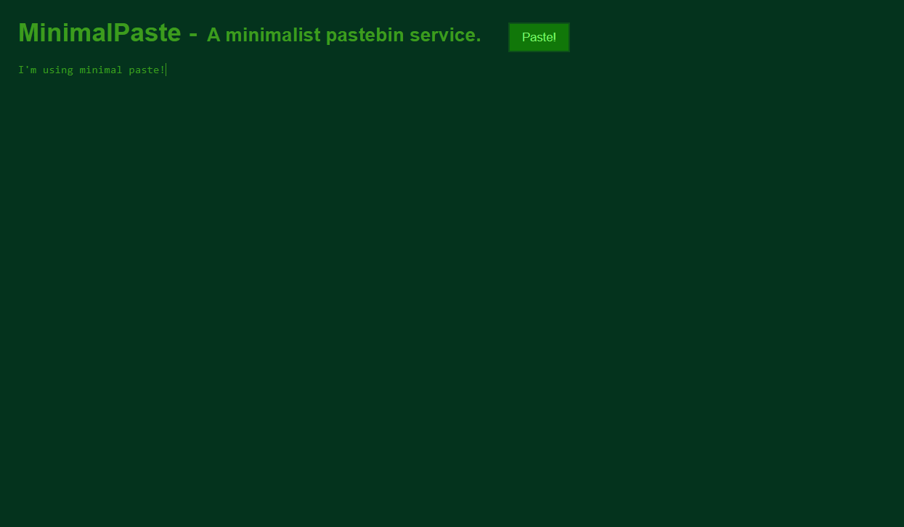

# MinimalPaste - A minimalist pastebin server



&nbsp;
## 🤔 What is this?  
MinimalPaste is a minimalist pastebin service that uses a multithread server made with Python3 using only
builtin resources. That is, you don't need to install any module in order to use it.
The only requirement in order to run it is Python3.

&nbsp;
## ✨ Features:
- Multithread server.
- Internal SQL database.
- Dynamic URL creation.
- Support to GET and POST requests.
- Battery of automated tests inside src/tests directory.

&nbsp;
## ⚙️ Setting up the server: 
- Download the repository:
    ```bash
    git clone http://github.com/arcticlimer/minimalpaste.git
    ```

- Change directory to source code directory:
    ```bash
    cd minimalpaste/src
    ```

- Run the server script:
    ```bash
    python app.py [<address> <port>]
    ```
    > If address and port are not provided, the server will start at 127.0.0.1 (localhost), port 8080.

- Done! Now you can access it!

&nbsp;
## 🤝 If you want to contribute:
- Assert your pull request pass all the automated tests and send it!
> Note: The server must be running at 127.0.0.1:8080 in order to be tested.
